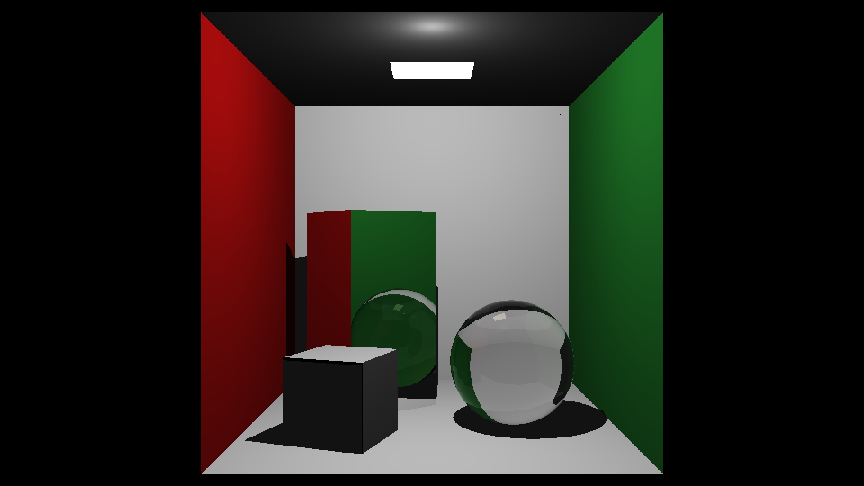
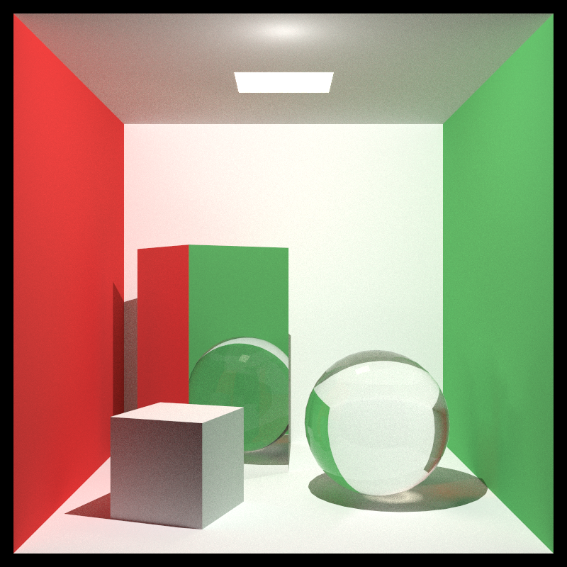
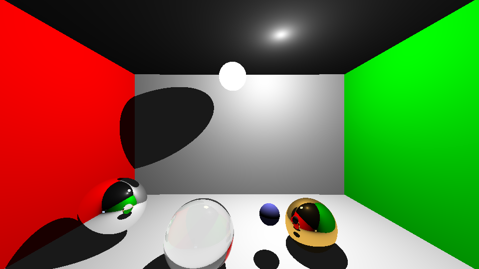
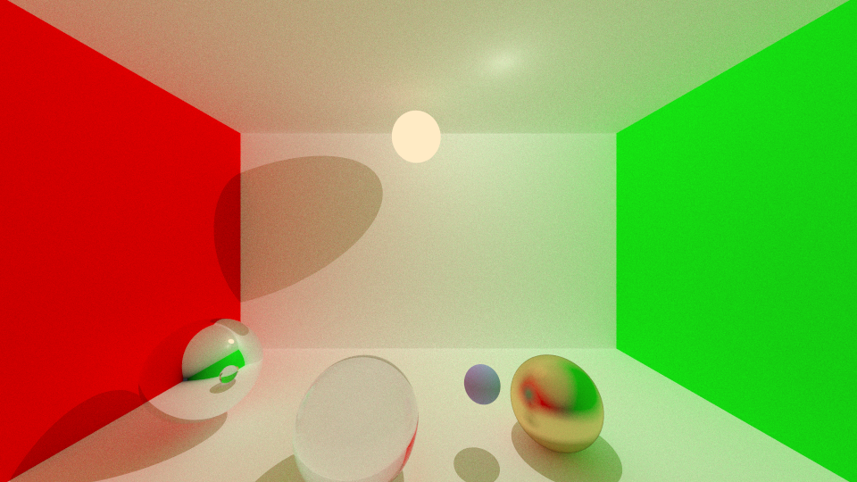

# Raytracer

Ein Raytracer in C++20 ohne Fremdbibliotheken für die Darstellung. Er rendert in eine BMP-Datei, entweder auf der CPU (alle Kerne) oder auf macOS mit Metal auf der GPU.

| Whitted | Path-Tracing |
|---|---|
|  |  |
|  |  |

## Funktionen

- **Whitted-Raytracing:** Punktlichtquellen (mehrere möglich) mit Schattenstrahlen, Spiegelung und Brechung.
- **Path-Tracing (optional, `--pt`):** diffuse Bounces mit indirektem Licht und Color Bleeding, unscharfe Reflexionen, Russian Roulette, Gamma-Korrektur.
- **Materialien:** diffus, Spiegel, glossy, Glas (Fresnel nach Schlick, Totalreflexion), leuchtend.
- **Geometrie:** Kugeln und Dreiecke (Vertexnormalen für glatte Schattierung).
- **Schnittpunkttest für Dreiecke:** Badouel (mit u-v-Parametern) und die optimierte Variante nach Möller-Trumbore.
- **Wavefront-Import:** `.obj` mit `.mtl`-Materialien.
- **Suche nach dem Schnittpunkt:** reine Brute-Force-Suche über alle Objekte.
- **Parallel:** Multithreading auf der CPU, optional Metal-Kernel auf der GPU (`--gpu`).
- **Reproduzierbar:** Zufallszahlen werden pro Pixel gesetzt, das Bild ist bei jedem Lauf und mit jeder Threadzahl identisch.

## Bauen

Benötigt werden CMake (≥ 3.9), ein C++20-Compiler und GoogleTest für die Tests. Auf macOS reicht:

```bash
brew install cmake googletest
cmake -S . -B build
cmake --build build
```

Das erzeugt die Programme `raytracer`, `math_test` und `geometry_test` in `build/`. Die Optimierung (`-O2`) ist fest eingestellt, auch für Debug-Profile.

Auf macOS wird zusätzlich der Metal-Renderer gebaut. Der Shader wird zur Laufzeit kompiliert, dafür ist kein Xcode nötig, die Command Line Tools genügen. Auf anderen Systemen wird nur die CPU-Variante gebaut, `--gpu` meldet dort einen Fehler.

## Benutzung

```bash
./build/raytracer                                    # eingebaute Kugelszene, Ausgabe: raytracer.bmp
./build/raytracer scenes/cornell_box.obj             # Szene aus einer Wavefront-Datei
./build/raytracer --pt -s 128                        # Path-Tracing mit 128 Samples pro Pixel
./build/raytracer scenes/cornell_box.obj --gpu --pt -s 256 -w 800 -h 800 -o box.bmp
```

Ohne `scene.obj` wird die eingebaute Szene aus Kugeln gerendert: eine Cornell-Box aus großen Kugeln mit Spiegel, Glas, glossy Gold und einer leuchtenden Kugel. Das Ergebnis liegt als BMP im Arbeitsverzeichnis.

### Parameter

Alle Parameter sind optional. Die Szene selbst ist nicht einstellbar.

| Parameter | Werte | Standard |
|---|---|---|
| `scene.obj` | Pfad zu einer Wavefront-Datei | eingebaute Kugelszene |
| `-w <pixel>` | ganze Zahl > 0 | 1280 |
| `-h <pixel>` | ganze Zahl > 0 | Breite × 9/16 (nur `-h`: Breite = Höhe × 16/9) |
| `-s <n>` | ganze Zahl > 0, Samples pro Pixel | 1, mit `--pt` 64 |
| `-d <n>` | ganze Zahl > 0, maximale Rekursionstiefe | 10 |
| `-t <n>` | ganze Zahl > 0, Threads (CPU) | alle Kerne |
| `-o <datei.bmp>` | Ausgabepfad | `raytracer.bmp` |
| `--pt` | Path-Tracing statt Whitted | aus |
| `--badouel` | Dreiecke mit Badouel statt Möller-Trumbore (nur CPU) | aus |
| `--gpu` | mit Metal auf der GPU rendern (nur macOS) | aus |
| `--cam x y z` | Kameraposition | Kugelszene: Ursprung, OBJ: automatisch vor der Szene |
| `--look x y z` | Blickpunkt | Kugelszene: Blick in −z, OBJ: Szenenmitte |
| `--fov <grad>` | vertikaler Öffnungswinkel, 0 bis 180 | Kugelszene: ca. 84, OBJ: 40 |
| `--light x y z` | Position der Punktlichtquelle | Kugelszene: (5, 11, −18), OBJ: oben vor der Szene |
| `--sky <wert>` | Himmelshelligkeit, ≥ 0 | Kugelszene: 1 (mit `--pt` 0,15), OBJ: 0 |
| `--exposure <wert>` | Helligkeitsfaktor, > 0 | 1 (Kugelszene mit `--pt` 0,25) |
| `--help` | Hilfe ausgeben | |

Bei ungültigen Werten gibt das Programm die Hilfe aus und beendet sich.

## Szenen im Wavefront-Format

`utility/obj_loader` unterstützt:

- `v`, `vn` und `f` in den Formen `v`, `v/vt`, `v//vn` und `v/vt/vn`, auch mit negativen Indizes. Polygone werden zu Dreiecken zerlegt. `vt` wird gelesen, aber nicht verwendet.
- `mtllib` und `usemtl`. Aus der `.mtl`-Datei werden diese Werte ausgewertet:

| Bedingung in der `.mtl` | Material |
|---|---|
| `Ke` > 0 | leuchtend (`EMISSIVE`), Farbe aus `Ke` |
| `d` < 1 (oder `Tr` > 0) | Glas (`GLASS`), Brechungsindex `Ni` |
| `illum` 3 oder 5 | Spiegel (`REFLECTIVE`), Farbe aus `Ks` |
| sonst | diffus (`LAMBERTIAN`), Farbe aus `Kd` |

Beim Laden wird die Kamera auf die Bounding Box der Szene ausgerichtet. Eine Punktlichtquelle wird oben, kurz hinter der Vorderkante der Szene platziert. Ohne Vertexnormalen wird die Normale des Dreiecks verwendet.

`scenes/cornell_box.obj` ist eine Cornell-Box (555 × 555 × 555, vorne offen) mit gedrehter Spiegelbox, kleiner weißer Box, Glaskugel mit glatten Normalen und einer Deckenlampe.

## Materialien

In `world/objects/material.h`. Der Typ ist ein `int`, die Konstanten heißen wie in der Tabelle:

| Typ | Wert | Zusatzparameter | Verhalten |
|---|---|---|---|
| `LAMBERTIAN` | 0 | | diffus, Lambert-Shading mit Schatten, mit `--pt` zusätzlich indirektes Licht |
| `REFLECTIVE` | 1 | | perfekter Spiegel, tönt die Reflexion mit der Materialfarbe |
| `GLOSSY` | 2 | `roughness` (0 bis 1) | unscharfe Reflexion, nur mit `--pt`, im Whitted-Modus wie ein Spiegel |
| `GLASS` | 3 | `refractionIndex` | Brechung und Reflexion nach Fresnel (Schlick), Totalreflexion |
| `EMISSIVE` | 4 | `emission` | leuchtet mit `emission × Farbe`, beleuchtet andere Flächen nur mit `--pt` |

Beispiel: `Material({1.f, 1.f, 1.f}, GLASS, 1.5f)`.

## Whitted und Path-Tracing

**Whitted** (Standard) ist deterministisch: Von jedem diffusen Treffer geht ein Schattenstrahl zu jeder Lichtquelle, Spiegel und Glas verfolgen Folgestrahlen (Glas teilt sich in Reflexion und Brechung). Diffuse Flächen werfen kein Licht zurück. Punkte im Schatten bekommen einen kleinen ambienten Anteil von 0,1.

**Path-Tracing** (`--pt`) ergänzt pro diffusem Treffer einen zufälligen, kosinusverteilten Bounce. Dadurch entsteht indirektes Licht, zum Beispiel die rötliche und grünliche Färbung der weißen Flächen neben den Wänden. Glas wählt zufällig zwischen Reflexion und Brechung (Wahrscheinlichkeit nach Fresnel), glossy streut. Das Bild rauscht und wird mit mehr Samples (`-s`) glatter. Das Punktlicht liefert weiterhin den rauschfreien Direktanteil. Leuchtende Objekte treffen die Strahlen nur zufällig, deshalb rauscht eine kleine Lampe stärker als das Punktlicht.

## GPU (Metal)

`--gpu` rechnet jeden Pixel in einem Metal-Compute-Kernel (`gpu/raytrace.metal`). Er ist ein Port von `Camera::ray_color`, `Camera::lambertian` und den Schnitttests und rechnet iterativ statt rekursiv. Der Host-Code in `gpu/metal_renderer.mm` packt die Szene in GPU-Puffer und rechnet in Zeilenblöcken, damit kein einzelner Aufruf zu lange läuft. Die Zufallszahlen sind dieselben wie auf der CPU, die Bilder stimmen daher praktisch überein.

Gemessen auf einem Apple M1 (Path-Tracing, 64 Samples):

| Szene | CPU (8 Kerne) | GPU |
|---|---|---|
| Kugelszene, 1280 × 720 | 51,5 s | 2,7 s |
| Cornell-Box, 480 × 270 | 57,4 s | 11,9 s |

Die Cornell-Box ist langsamer, weil jeder Strahl alle 876 Dreiecke prüft. Der Kernel nutzt wie die CPU die Brute-Force-Suche, `--badouel` gilt nur für die CPU.

## Aufbau

```
raytracer.cc            main: Kommandozeile, eingebaute Kugelszene, Szenenaufbau
math/                   Vector (+ Tests), Zufallszahlen
geometry/               Ray, Sphere, Triangle (Badouel, Möller-Trumbore), AABB, refract (+ Tests)
world/                  World, WorldObject, Brute-Force-Suche; objects/material.*
view/                   Camera (ray_color, lambertian), Viewport, Window (Render, Threads, BMP)
utility/                color, light, bmp (BMP-Schreiber), obj_loader (Wavefront)
gpu/                    Metal-Kernel und Host-Code (nur macOS)
scenes/                 Testszene cornell_box.obj/.mtl
docs/                   Beispielbilder für diese README
```

Die Kamera blickt standardmäßig aus dem Ursprung in −z. `Camera::look_at`, `Camera::set_fov` und `Camera::up` richten sie anders aus. Die Bildebene wird bei jedem `Window::Render()` neu berechnet.

## Tests

```bash
./build/math_test
./build/geometry_test
```

Dazu gehört ein Test, der Badouel und Möller-Trumbore an 20.000 zufälligen Strahl-Dreieck-Paaren vergleicht (Treffer, `t`, `u`, `v`, Normale).

## Hinweise

- **`Vector::cross_product`:** Die ursprüngliche Version hatte ein falsches Vorzeichen in der y-Komponente. Dadurch lieferte der Badouel-Test für schräge Dreiecke falsche Schnittpunkte. Die Funktion und die Tests `CrossVectorProduct2` bis `6` sind korrigiert. Wer Code aus einer älteren Kopie von `math.tcc` übernimmt, bringt den Fehler mit.
- **Zufallszahlen:** `random_unit_vector` und Verwandte aus `math/math.h` arbeiten mit einem thread-lokalen xorshift32 statt mit `rand()`. `seed_random` setzt den Zustand pro Pixel.
- **Float-Genauigkeit:** Die Wände der eingebauten Szene sind Kugeln mit Radius 10000. Folgestrahlen starten deshalb mit einem Abstand (`World::ray_bias`, Standard 0,01) von der Oberfläche. Bei OBJ-Szenen wird er aus der Größe der Szene berechnet.

## Grenzen

- Keine Texturen, `vt` wird ignoriert.
- Keine Beschleunigungsstruktur: Die Laufzeit wächst linear mit der Zahl der Dreiecke.
- Die Szene (Objekte, Materialien, Anzahl der Lichter) lässt sich nicht über die Kommandozeile ändern, nur die Kamera und die Lichtposition.
- Lichter sind Punktlichter. Flächenlichter gibt es nur als leuchtende Objekte, sie werden nicht gezielt gesampelt.
- Die GPU-Variante gibt es nur auf macOS.
